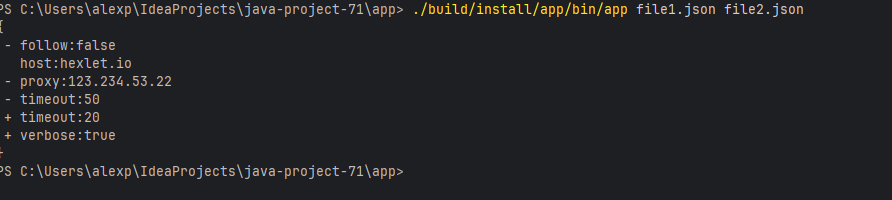

### Hexlet tests and linter status:
[](https://github.com/riese1989/java-project-71/actions)
[](https://sonarcloud.io/summary/new_code?id=riese1989_java-project-71)

## Run checkstyle

```bash
MinGW32-make lint
```

